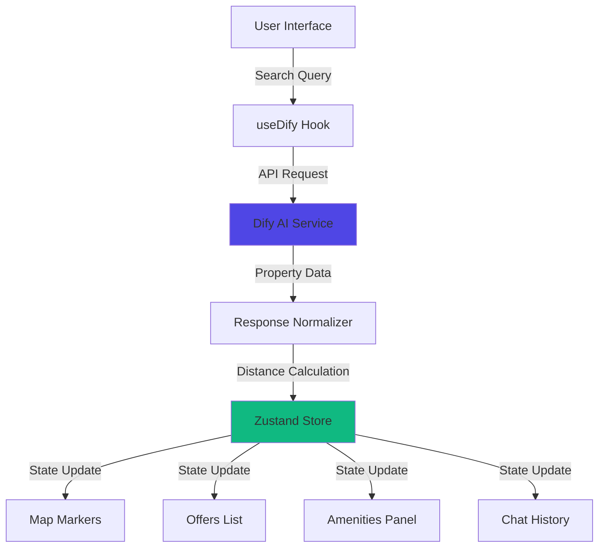

# 🏡 NestAI Agent

**AI-Powered Real Estate Discovery Platform**

An intelligent, map-first home finder that combines interactive geospatial visualization with AI-driven property search. NestAI Agent leverages natural language processing to help users discover rental and purchase opportunities, compare amenities, and explore neighborhoods through an intuitive conversational interface.

---

## 📋 Table of Contents

- [Features](#-features)
- [Quick Start](#-quick-start)
- [Environment Configuration](#-environment-configuration)
- [Architecture Overview](#-architecture-overview)
- [User Interface Guide](#-user-interface-guide)
- [Voice & Chat Capabilities](#-voice--chat-capabilities)
- [AI Integration](#-ai-integration)
- [Development](#-development)
- [Troubleshooting](#-troubleshooting)
- [Contributing](#-contributing)
- [License](#-license)

---

## ✨ Features

- **🗺️ Interactive Map Interface** – Real-time geospatial visualization with radius-based search
- **🤖 AI-Powered Search** – Natural language queries powered by Dify/OpenAI
- **📊 Smart Filtering** – Distance-based filtering with intelligent fallback to nearest matches
- **🏢 Comprehensive Amenity Analysis** – Categorized nearby points of interest (groceries, parks, schools, transit, healthcare, fitness)
- **💬 Conversational UI** – Full chat history with context-aware responses
- **🎤 Voice Input** – Hands-free search with speech-to-text capabilities
- **📱 Responsive Design** – Optimized for desktop and mobile experiences
- **⚡ Real-Time Updates** – Live property data with instant map synchronization

---

## 🚀 Quick Start

### Prerequisites

- Node.js 18.x or higher
- npm 8.x or higher
- Modern web browser with JavaScript enabled

### Installation

```bash
# Clone the repository
git clone https://github.com/your-org/nestai-agent.git
cd nestai-agent

# Install dependencies
npm install

# Configure environment variables
cp .env.example .env
```

### Configuration

Edit `.env` with your Dify API credentials (see [Environment Configuration](#-environment-configuration) for details).

### Running the Application

```bash
# Development mode with hot reload
npm run dev

# Production build
npm run build

# Preview production build
npm run preview
```

The application will be available at `http://localhost:5173` (development) or the configured port.

---

## 🔐 Environment Configuration

Create a `.env` file in the project root with the following variables:

| Variable | Required | Default | Description |
|----------|----------|---------|-------------|
| `VITE_DIFY_API_KEY` | **Yes** | — | Your Dify API key for AI service authentication |
| `VITE_DIFY_MODE` | No | `workflow` | Dify application type: `workflow` or `chat` |
| `VITE_DIFY_ENDPOINT` | No | Auto | Custom Dify API endpoint (overrides default) |

### Example Configuration

```bash
VITE_DIFY_API_KEY=your_api_key_here
VITE_DIFY_MODE=workflow
# VITE_DIFY_ENDPOINT=https://custom-endpoint.example.com/v1
```

> **⚠️ Security Note:** Keep API keys secure. For production deployments, consider implementing a backend proxy to avoid exposing credentials in the client.

---

## 🏗️ Architecture Overview

### Data Flow



### Core Components

#### State Management
- **Store:** Zustand-based global state (`src/store/appStore.ts`)
- **Persistence:** React Query for server state caching
- **Real-time Updates:** Automatic re-rendering on state changes

#### API Integration
- **Hook:** `src/hooks/useDify.ts` handles all AI service communication
- **Payload Structure:**
  ```typescript
  {
    latitude: number,
    longitude: number,
    radius: number,
    transaction_type: 0 | 1, // 0 = buy, 1 = rent
    prompt: string
  }
  ```
- **Response Normalization:** Automatic distance calculation and filtering

#### Filtering Logic
1. **Radius-based:** Primary filtering by geographic distance
2. **Fallback Mode:** Displays nearest matches when radius yields no results
3. **Client-side Processing:** Efficient filtering without additional API calls

---

## 🎨 User Interface Guide

### Main Layout

#### Map View (Persistent)
- **Search Center Marker:** Indicates the query origin point
- **Radius Circle:** Visual representation of search boundary
- **Property Markers:** Interactive pins for each listing
- **Amenity Highlights:** Context-aware POI display when properties are selected

#### Side Panel (Tabbed Interface)

##### 1. Offers Tab
- **Ranked Listings:** AI-scored properties with relevance indicators
- **Quick Filters:** Category chips for rapid refinement
- **Detail Cards:** Expandable views with:
  - Photo galleries
  - AI-generated summaries
  - Pros & cons analysis
  - Nearby amenities with distances
  - Direct listing links

##### 2. Amenities Tab
- **Categorized POIs:**
  - 🛒 Groceries & Shopping
  - 🌳 Parks & Recreation
  - 🏫 Schools & Education
  - 🚇 Public Transit
  - 🏥 Healthcare Facilities
  - 💪 Fitness Centers
- **Distance Display:** Walking/driving time estimates
- **Map Integration:** Click to highlight on map

##### 3. Chat Tab
- **Conversation History:** Full message thread with NestAI
- **Message Input:** Text entry with send button
- **Context Awareness:** AI remembers search parameters and preferences

### Panel Controls
- **Toggle Button:** Bottom-right handle to show/hide side panel
- **Responsive Behavior:** Auto-collapse on mobile, persistent on desktop
- **Keyboard Shortcuts:** `Esc` to close details, `Tab` for navigation

---

## 🎤 Voice & Chat Capabilities

### Voice Input
- **Activation:** Press and hold the microphone button
- **Recording:** Speak your search query naturally
- **Processing:** Automatic speech-to-text conversion on release
- **Integration:** Transcript sent directly as chat message

**Implementation:** See `src/hooks/useVoice.ts` for technical details

### Chat Interface
- **Natural Language:** Conversational queries (e.g., "Find a 2-bedroom apartment near parks under $2000")
- **Contextual Memory:** AI retains search context across messages
- **Quick Actions:** Predefined chips for common refinements
- **Rich Responses:** Formatted listings with interactive elements

---

## 🤖 AI Integration

### Dify Service Configuration

**Primary Hook:** `src/hooks/useDify.ts`

#### Request Payload
```typescript
{
  latitude: number,      // Search center latitude
  longitude: number,     // Search center longitude
  radius: number,        // Search radius in meters
  transaction_type: 0|1, // 0 = purchase, 1 = rental
  prompt: string         // User's natural language query
}
```

#### Response Processing
1. **Normalization:** Standardize property data structure
2. **Distance Calculation:** Compute distances from search center
3. **Filtering:** Apply radius constraints with intelligent fallback
4. **Enrichment:** Add amenity proximity data
5. **Scoring:** Apply AI relevance scoring

#### Environment Variables
- `VITE_DIFY_API_KEY`: Authentication credential
- `VITE_DIFY_MODE`: Service mode (`workflow` | `chat`)
- `VITE_DIFY_ENDPOINT`: Optional custom endpoint

### State Management

**Store Location:** `src/store/appStore.ts`

**Managed State:**
- User location and search parameters
- Property listings with metadata
- Amenity data with categories
- Chat message history
- Active tab and UI state

**Type Definitions:** `src/types/index.ts`

---

## 🛠️ Development

### Tech Stack

| Category | Technology |
|----------|-----------|
| **Build Tool** | Vite 5.x |
| **Framework** | React 18.x |
| **Language** | TypeScript 5.x |
| **Styling** | Tailwind CSS 3.x + shadcn/ui |
| **State** | Zustand 4.x |
| **Data Fetching** | React Query 5.x |
| **Animation** | Framer Motion 11.x |
| **Mapping** | Leaflet 1.9.x |
| **Compiler** | SWC |

### Available Scripts

```bash
# Start development server with HMR
npm run dev

# Type-check TypeScript
npm run type-check

# Lint codebase
npm run lint

# Format code with Prettier
npm run format

# Run tests
npm run test

# Build for production
npm run build

# Preview production build locally
npm run preview

# Analyze bundle size
npm run analyze
```

### Project Structure

```
nestai-agent/
├── src/
│   ├── components/       # React components
│   ├── hooks/           # Custom React hooks
│   ├── store/           # Zustand stores
│   ├── types/           # TypeScript definitions
│   ├── utils/           # Helper functions
│   └── App.tsx          # Root component
├── public/              # Static assets
├── .env.example         # Environment template
└── package.json         # Dependencies
```

### Code Quality

- **TypeScript:** Strict mode enabled for type safety
- **ESLint:** Configured with React and TypeScript rules
- **Prettier:** Consistent code formatting
- **Husky:** Pre-commit hooks for quality checks

---

## 🔧 Troubleshooting

### Common Issues

#### No Results Displayed

**Symptoms:** Empty offers list despite successful search

**Solutions:**
1. Verify `VITE_DIFY_API_KEY` is set correctly
2. Check browser console for `[Dify]` error logs
3. Confirm Dify service mode matches `VITE_DIFY_MODE`
4. Validate API endpoint accessibility

```bash
# Test API connectivity
curl -H "Authorization: Bearer YOUR_API_KEY" \
  https://api.dify.ai/v1/workflows/run
```

#### Results Outside Search Radius

**Expected Behavior:** Client-side fallback to nearest matches

**Details:**
- When no properties exist within the specified radius, the app displays the closest available options
- A notice informs users that results are outside the requested area
- Adjust search radius or relocate search center to refine results

#### Voice Input Not Working

**Symptoms:** Microphone button unresponsive or no transcription

**Solutions:**
1. Check browser microphone permissions
2. Ensure HTTPS connection (required for Web Speech API)
3. Test with supported browsers (Chrome, Edge, Safari)
4. Fallback: Use text input in Chat tab

**Browser Compatibility:**
| Browser | Voice Support |
|---------|--------------|
| Chrome 90+ | ✅ Full |
| Edge 90+ | ✅ Full |
| Safari 14+ | ✅ Full |
| Firefox | ⚠️ Limited |

#### Build Failures

**Common Causes:**
- Node version mismatch (requires 18+)
- Missing environment variables
- Corrupted dependencies

**Resolution:**
```bash
# Clear cache and reinstall
rm -rf node_modules package-lock.json
npm install

# Verify Node version
node --version  # Should be 18.x or higher
```

### Debug Mode

Enable verbose logging:

```typescript
// src/config.ts
export const DEBUG = {
  dify: true,
  maps: true,
  voice: true
};
```

---

### Development Workflow

1. Fork the repository
2. Create a feature branch (`git checkout -b feature/amazing-feature`)
3. Commit changes (`git commit -m 'Add amazing feature'`)
4. Push to branch (`git push origin feature/amazing-feature`)
5. Open a Pull Request

### Code Standards

- Follow existing code style
- Add tests for new features
- Update documentation as needed
- Ensure all tests pass before submitting

---

## 📄 License

This project is licensed under the MIT License - see the [LICENSE](LICENSE) file for details.

---

## 📞 Support

- **Email:** rishtiwari98@gmail.com

---

<p align="center">
  Made with ❤️ by the NestAI Team
</p>