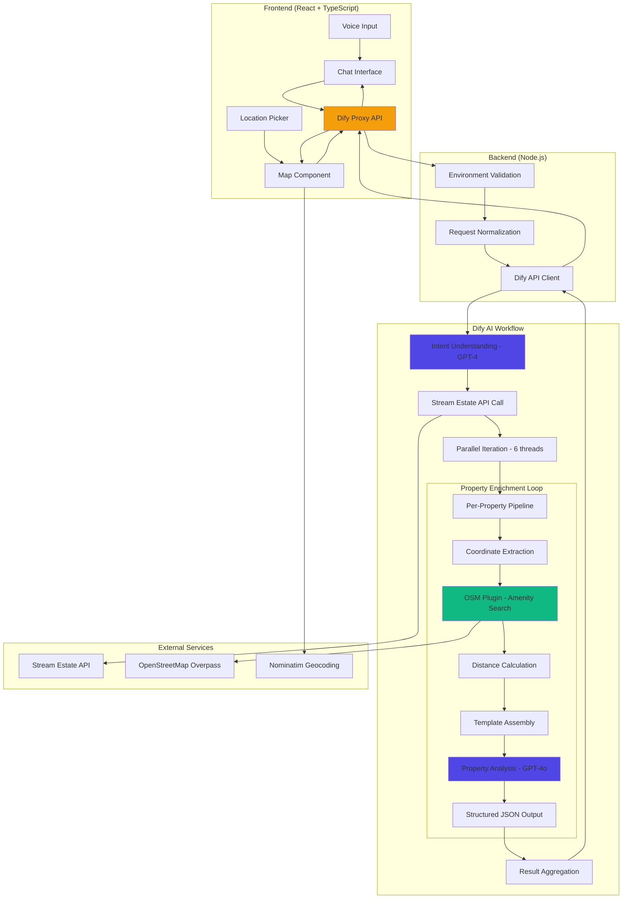

# NestAI Agent

**Voice-First AI Real Estate Discovery Platform**

Transform the way you find your next home. NestAI Agent is an intelligent, conversational property discovery assistant that combines cutting-edge AI orchestration, real-time geospatial analysis, and natural language understanding to deliver personalized real estate recommendations with neighborhood-aware insights.

<p align="center">
  
  
  
  
</p>

---

## 🎯 The Vision

### Why NestAI Exists

Finding the perfect home is one of life's most important decisions—yet the traditional search process is fragmented, time-consuming, and overwhelming. You're forced to juggle multiple tabs, manually cross-reference amenities, convert walking times, and piece together neighborhood insights from disparate sources.

**NestAI Agent reimagines this experience entirely.**

Instead of searching *for* properties, you have a conversation *about* what matters to you. Want a quiet apartment near parks with good transit access under €1,200? Just say it. NestAI orchestrates a sophisticated AI pipeline that:

- Fetches live property listings from real estate APIs
- Enriches every property with real-world amenity data from OpenStreetMap
- Calculates actual walking distances to groceries, parks, schools, transit, healthcare, and fitness centers
- Analyzes each property against your stated preferences using GPT-4
- Delivers structured, data-driven recommendations with pros, cons, and match scores

All through a **voice-first conversational interface** backed by an **advanced Dify AI workflow** that handles multi-turn dialogue, parallel data processing, and intelligent follow-up questions.

### The Problem We Solve

| Traditional Search | NestAI Agent |
|-------------------|--------------|
| Filter by bedroom count, price, location—manually | Describe what you need in natural language |
| Open each listing individually to check details | See AI-analyzed summaries with match scores |
| Google Map each property to find nearby amenities | Automatic amenity enrichment with real walking distances |
| Guess if a neighborhood fits your lifestyle | Data-driven pros/cons based on your priorities |
| Compare properties by switching tabs and memory | Side-by-side AI comparison with contextual insights |
| Repeat the same search across multiple platforms | One conversation that remembers your preferences |

NestAI isn't just a search tool—it's an **AI-powered relocation advisor** that understands context, learns your preferences, and guides you to better decisions faster.

---

## ✨ Core Features

### 🎤 Voice-First Interaction
- **Push-to-talk interface** with Web Speech API integration
- Natural language property search: *"Find a quiet 2-bedroom near parks under €1,500"*
- Hands-free exploration with optional speech synthesis responses
- Automatic transcript-to-chat conversion

### 🗺️ Intelligent Geospatial Analysis
- **Location-aware search** via Nominatim geocoding (cities, neighborhoods, addresses)
- **Interactive map picker** with radius overlay visualization
- **Live location support** with one-tap geolocation
- Dynamic radius filtering (1km, 3km, 7km, 10km)
- Real-time map synchronization with search results

### 🤖 AI-Orchestrated Property Intelligence
- **Dify-powered advanced chat workflow** with conversation memory
- **Parallel property enrichment** (6 concurrent threads) for instant results
- **Custom OpenStreetMap plugin** for amenity discovery (groceries, parks, schools, transit, healthcare, fitness)
- **Structured AI evaluation** with JSON schema enforcement (match scores, pros, cons)
- **Multi-model architecture**: GPT-4 for intent understanding, GPT-4o for property analysis

### 📊 Data-Driven Recommendations
- **Match scoring** (1-10 scale) based on your stated preferences
- **Pros/cons analysis** extracted from property + amenity context
- **Walking distance calculations** using Equirectangular approximation
- **Sorted amenity lists** showing nearest options per category
- **Rank-based sorting** with visual score badges

### 🔄 Contextual Comparison
- **Side-by-side property comparison** with AI-generated insights
- Select any 2 properties to compare location advantages, amenity access, and value
- Separate AI analysis for each property relative to the other

### 💾 Smart Session Management
- **IndexedDB persistence** for conversation history
- **7-day amenity caching** to minimize API calls
- **Session restoration** across page reloads
- **Last-search memory** for location, radius, price range

### 🎨 Premium User Experience
- **Calm, high-end design** optimized for focus and clarity
- **Dual-panel layout**: persistent map + tabbed results (Offers, Amenities, Chat)
- **Quick-action chips** for common refinements (Quieter, More parks, Closer transit, etc.)
- **Responsive design** with mobile-first optimizations
- **Dark/light theme** support
- **Demo mode** for instant exploration (Berlin example with live data)

---

## 🏗️ Architecture

### System Overview



### Data Flow: Search Request

1. **User Input** → Voice/text query + location + radius + price range
2. **Frontend Validation** → Check location exists; build request payload
3. **Backend Proxy** → `/api/dify/run` forwards to Dify with secure credentials
4. **Dify Orchestration**:
   - **LLM 1** (GPT-4): Interpret user intent and context
   - **HTTP Node**: Fetch live properties from Stream Estate API
   - **Code Node**: Parse JSON response
   - **Iteration Node** (parallel, 6x):
     - Extract property coordinates
     - **OSM Plugin**: Query nearby amenities (2km radius, all categories)
     - **Code Node**: Calculate walking distances, sort by proximity
     - **Template Node**: Build structured prompt with property + amenities
     - **LLM 2** (GPT-4o + Structured Output): Generate `match_score`, `pros`, `cons`, `agent_summary`
     - **Code Node**: Merge analysis with property data
   - **Code Node**: Serialize final results
5. **Backend Response** → Normalize to unified schema, return to frontend
6. **Frontend Rendering** → Update map markers, populate offer cards, display assistant text

### Technology Stack

| Layer | Technology | Purpose |
|-------|-----------|---------|
| **Frontend Framework** | React 18 + TypeScript 5 | Type-safe component architecture |
| **Build Tool** | Vite 5 + SWC | Lightning-fast dev server and builds |
| **Styling** | Tailwind CSS 3 + shadcn/ui | Utility-first design with accessible components |
| **State Management** | Zustand 4 | Minimal, reactive global state |
| **Data Fetching** | React Query 5 | Server state caching and synchronization |
| **Mapping** | Leaflet 1.9 | Interactive geospatial visualization |
| **Animation** | Framer Motion 11 | Smooth, performant UI transitions |
| **Persistence** | IndexedDB (idb) | Client-side storage for sessions and cache |
| **Voice Input** | Web Speech API | Browser-native speech recognition |
| **Backend Runtime** | Node.js 18+ | API proxy and environment security |
| **AI Orchestration** | Dify (Advanced Chat) | Multi-stage workflow with parallel processing |
| **AI Models** | OpenAI GPT-4 + GPT-4o | Intent understanding and property analysis |
| **Geocoding** | Nominatim (OSM) | Address search and reverse geocoding |
| **Amenity Data** | Overpass API (OSM) | Real-world POI data via custom Dify plugin |
| **Property Data** | Stream Estate API | Live rental and sale listings |

---

## 🚀 Quick Start

### Prerequisites

- **Node.js** 18.x or higher
- **npm** 8.x or higher
- **Dify account** with workflow API access
- **Stream Estate API key** (configured in Dify)

### Installation

```bash
# Clone the repository
git clone https://github.com/your-org/nestai-agent.git
cd nestai-agent

# Install dependencies
npm install

# Set up environment variables
cp .env.example .env.local
```

### Environment Configuration

Edit `.env.local`:

```bash
# Dify AI Configuration (Backend-only, never exposed to client)
DIFY_BASE_URL=https://api.dify.ai/v1
DIFY_WORKFLOW_API_KEY=your_dify_workflow_key_here

# Optional: Override Dify endpoint
# DIFY_ENDPOINT=https://custom-dify-instance.com/v1

# Stream Estate API Key (stored in Dify environment variables)
# This is configured in your Dify workflow, not in .env
```

> **🔒 Security:** All API keys live server-side. The frontend **never** receives credentials.

### Running the Application

```bash
# Development mode with hot reload
npm run dev
# → Opens at http://localhost:5173

# Production build
npm run build

# Preview production build
npm run preview
```

---

## 🎯 How to Use

### 1. Set Your Location

Choose one of three methods:

- **🔍 Search**: Enter city, neighborhood, or address (powered by Nominatim)
- **📍 Live Location**: Tap "Use my location" (requires HTTPS/localhost)
- **🗺️ Map Picker**: Open full-screen map, click to place pin, drag to adjust

### 2. Configure Search Parameters

- **Country** (optional): Filter by country code
- **Radius**: Select 1km, 3km, 7km, or 10km search area
- **Price Range**: State in natural language or use quick chips

### 3. Describe What You Want

**Examples:**
- *"2-bedroom apartment near parks, quiet street, under €1,500/month"*
- *"Family home with good schools, close to transit, spacious"*
- *"Modern studio near fitness centers and groceries, pet-friendly"*

### 4. Explore Results

**Map View:**
- Property markers with rank badges
- Amenity markers (when property selected)
- Radius circle overlay
- Recenter and change location controls

**Offers Tab:**
- AI-ranked property cards
- Match scores (1-10)
- Photo carousels
- Pros/cons analysis
- Price and address
- Select for comparison

**Amenities Tab:**
- Categorized nearby POIs:
  - 🛒 Groceries
  - 🌳 Parks
  - 🏫 Schools
  - 🚇 Transit
  - 🏥 Healthcare
  - 💪 Fitness
- Walking distances
- Expandable lists

**Chat Tab:**
- Full conversation history
- Quick refinement chips
- Voice input button

### 5. Compare Properties

1. Select **exactly 2 properties** via checkboxes
2. Tap **Compare** icon in top bar
3. View side-by-side analysis with:
   - Property summaries
   - AI-generated comparison insights
   - Location advantages
   - Amenity access differences

### 6. Refine Your Search

Use **quick-action chips**:
- Quieter
- More parks
- Closer transit
- Cheaper
- Better schools
- More fitness

Or continue the conversation naturally—NestAI remembers context.

---

## 🤝 Partners & Technologies

### Core Platform Partners

<table>
<tr>
<td align="center" width="33%">
<h3>🎨 Lovable AI</h3>
<p><strong>UI Boilerplate & Rapid Prototyping</strong></p>
<p>Accelerated frontend development with AI-assisted component generation and design system implementation</p>
</td>
<td align="center" width="33%">
<h3>🧠 Dify</h3>
<p><strong>AI Orchestration Engine</strong></p>
<p>Advanced Chat workflow platform powering our multi-stage property intelligence pipeline with parallel processing and plugin extensibility</p>
</td>
<td align="center" width="33%">
<h3>🤖 OpenAI</h3>
<p><strong>Language Models</strong></p>
<p>GPT-4 for intent understanding and GPT-4o for structured property analysis with JSON schema enforcement</p>
</td>
</tr>
</table>

### Additional Services

- **OpenStreetMap** – Amenity data via custom Dify plugin
- **Stream Estate** – Live property listings API
- **Nominatim** – Geocoding and reverse geocoding

---

## 📡 API Reference

### Backend Endpoint

**POST** `/api/dify/run`

The **only** backend endpoint. Proxies requests to Dify with secure credential injection.

#### Request Body (Chat Mode)

```json
{
  "mode": "chat",
  "user_prompt": "Quiet 2-bedroom near parks under €1,200",
  "session_id": "uuid-v4-string",
  "user_id": 12345,
  "locale": "en",
  "countryCode": "DE",
  "price_min": 0,
  "price_max": 1200,
  "radiusKm": 3,
  "location": {
    "lat": 52.52,
    "lng": 13.405
  }
}
```

#### Request Body (Compare Mode)

```json
{
  "mode": "compare",
  "session_id": "uuid-v4-string",
  "user_id": 12345,
  "offer_id1": 42,
  "offer_id2": 89
}
```

#### Response (Chat Mode)

```json
{
  "assistant_text": "I found 5 properties matching your criteria. Here are the top options:",
  "session_id": "uuid-v4-string",
  "user_id": 12345,
  "offers": [
    {
      "property_id": 92001,
      "lat": 52.5189,
      "long": 13.4012,
      "rank": 0.87,
      "photos": [
        "https://cdn.example.com/property1.jpg"
      ],
      "price": 1150,
      "rent_or_buy": true,
      "adress": "Prenzlauer Berg, Berlin",
      "redirect_url": "https://provider.com/listing/92001",
      "analysis": {
        "summary": "Spacious 2-bedroom in quiet residential area with excellent park access",
        "pros": [
          "Walking distance to Volkspark Friedrichshain (350m)",
          "Direct tram connection to Alexanderplatz",
          "Below budget with modern renovations"
        ],
        "cons": [
          "Limited grocery options within 500m",
          "No elevator in building"
        ]
      },
      "nice_to_have": {
        "area_m2": 68,
        "rooms": 2,
        "posted_date": "2026-02-05"
      },
      "closest_amenity_ids": [101, 205, 312]
    }
  ],
  "amenities": [
    {
      "amenity_id": 101,
      "lat": 52.5225,
      "long": 13.4115,
      "category": "parks",
      "description": "Volkspark Friedrichshain"
    }
  ]
}
```

#### Response (Compare Mode)

```json
{
  "action": "compare",
  "assistant_text_property1": "Property 1 offers superior park access and quieter location, ideal for relaxation. However, it's farther from transit.",
  "assistant_text_property2": "Property 2 prioritizes convenience with metro at doorstep and more dining options. Trade-off: busier street, less green space."
}
```

---

## 🔧 Development

### Project Structure

```
nestai-agent/
├── src/
│   ├── components/          # React components
│   │   ├── map/            # Leaflet map components
│   │   ├── chat/           # Chat interface and voice
│   │   ├── offers/         # Property cards and lists
│   │   ├── amenities/      # POI display and filtering
│   │   └── ui/             # shadcn/ui base components
│   ├── hooks/              # Custom React hooks
│   │   ├── useDify.ts      # Dify API integration
│   │   ├── useVoice.ts     # Web Speech API wrapper
│   │   ├── useLocation.ts  # Geolocation and geocoding
│   │   └── useAmenities.ts # OSM Overpass queries
│   ├── store/              # Zustand state management
│   │   └── appStore.ts     # Global app state
│   ├── types/              # TypeScript definitions
│   │   └── index.ts        # Property, amenity, API types
│   ├── utils/              # Helper functions
│   │   ├── distance.ts     # Haversine calculations
│   │   ├── geocoding.ts    # Nominatim integration
│   │   └── cache.ts        # IndexedDB operations
│   ├── lib/                # Third-party configurations
│   └── App.tsx             # Root component
├── server/                 # Backend proxy
│   └── api/
│       └── dify.ts         # POST /api/dify/run handler
├── public/                 # Static assets
├── .env.example            # Environment template
├── .env.local              # Local secrets (gitignored)
└── package.json
```

### Available Scripts

```bash
# Development
npm run dev              # Start dev server with HMR
npm run dev:server       # Start backend only
npm run dev:client       # Start frontend only

# Code Quality
npm run type-check       # TypeScript validation
npm run lint             # ESLint check
npm run lint:fix         # Auto-fix linting issues
npm run format           # Prettier formatting

# Testing
npm run test             # Run test suite
npm run test:watch       # Watch mode
npm run test:coverage    # Coverage report

# Build
npm run build            # Production build
npm run preview          # Preview production build
npm run analyze          # Bundle size analysis

# Database
npm run db:clear         # Clear IndexedDB cache
```

### Code Standards

- **TypeScript Strict Mode**: Enabled for maximum type safety
- **ESLint**: React, TypeScript, and accessibility rules
- **Prettier**: Consistent formatting (2-space indent, single quotes)
- **Husky**: Pre-commit hooks for lint and type-check
- **Conventional Commits**: Standardized commit messages

### Adding Features

#### Example: New Amenity Category

1. Update `src/types/index.ts`:
```typescript
export type AmenityCategory = 
  | 'groceries' 
  | 'parks' 
  | 'schools' 
  | 'transit' 
  | 'healtcare' 
  | 'fitness'
  | 'restaurants'; // New category
```

2. Add Overpass query in `src/utils/amenities.ts`
3. Update category icons in `src/components/amenities/CategoryIcon.tsx`
4. Coordinate with Dify workflow to support new category in OSM plugin

---

## 🐛 Troubleshooting

### No Properties Displayed

**Symptoms:** Empty offers list despite successful search

**Diagnostic Steps:**

1. **Check Dify Connection**
   ```bash
   # Test backend proxy
   curl -X POST http://localhost:5173/api/dify/run \
     -H "Content-Type: application/json" \
     -d '{"mode":"chat","user_prompt":"test","location":{"lat":52.52,"lng":13.405},"radiusKm":3,"session_id":"test","user_id":1}'
   ```

2. **Verify Environment Variables**
   ```bash
   # Backend must have these set
   echo $DIFY_BASE_URL
   echo $DIFY_WORKFLOW_API_KEY
   ```

3. **Inspect Browser Console**
   - Look for `[Dify]` error logs
   - Check Network tab for failed `/api/dify/run` requests
   - Verify response structure matches schema

**Common Causes:**
- Missing or invalid `DIFY_WORKFLOW_API_KEY`
- Dify workflow not deployed or paused
- Stream Estate API key not configured in Dify environment variables
- Firewall blocking Dify API access

---

### Map Not Rendering

**Symptoms:** Blank map area or broken tiles

**Solutions:**

1. **Location Not Selected**
   - Map doesn't render until location is chosen
   - Check that location state exists in Zustand store

2. **Leaflet CSS Missing**
   ```typescript
   // Ensure in index.html or App.tsx
   import 'leaflet/dist/leaflet.css';
   ```

3. **Tile Server Issues**
   - Default: OpenStreetMap tiles
   - Check browser console for 403/404 errors
   - Fallback: Switch to alternative tile provider

4. **Browser Compatibility**
   - Leaflet requires modern browser with Canvas support
   - Check `caniuse.com/canvas` for compatibility

---

### Voice Input Not Working

**Symptoms:** Microphone button unresponsive or no transcription

**Browser Compatibility:**

| Browser | Support | Notes |
|---------|---------|-------|
| Chrome 90+ | ✅ Full | Recommended |
| Edge 90+ | ✅ Full | Chromium-based |
| Safari 14+ | ✅ Full | macOS/iOS only |
| Firefox 89+ | ⚠️ Partial | Requires `media.webspeech.recognition.enable` flag |

**Common Issues:**

1. **Permissions Denied**
   - Check browser mic permissions in Settings
   - Requires **HTTPS** or **localhost** (HTTP blocked)
   - User must grant permission on first use

2. **No Speech Recognition API**
   ```javascript
   // Check support
   if (!('webkitSpeechRecognition' in window) && !('SpeechRecognition' in window)) {
     console.error('Speech recognition not supported');
   }
   ```

3. **Language Mismatch**
   - Ensure browser language matches recognition language
   - Override in `src/hooks/useVoice.ts` if needed

**Fallback:** Use text input in Chat tab for all functionality.

---

### Results Outside Search Radius

**Expected Behavior:** Intelligent fallback to nearest matches

**How It Works:**

1. User sets radius (e.g., 3km)
2. Dify searches property APIs
3. If **no results within radius**:
   - Client displays **nearest available** properties
   - Shows notice: *"No properties found within 3km. Showing nearest matches."*
4. If **results exist within radius**:
   - Only in-radius properties render
   - Others filtered client-side

**To Get In-Radius Results:**
- Increase radius (7km or 10km)
- Adjust location to denser area
- Broaden search criteria (price, bedrooms)

---

### Amenities Not Loading

**Symptoms:** Empty amenity counts or missing POI markers

**Diagnostic Steps:**

1. **Check Overpass API Status**
   ```bash
   # Test primary endpoint
   curl "https://overpass-api.de/api/status"
   
   # Test fallback
   curl "https://overpass.kumi.systems/api/status"
   ```

2. **Verify Cache**
   - Open DevTools → Application → IndexedDB → `nestai-cache`
   - Look for keys matching `lat:lng:radiusKm:amenities:v1`
   - Clear cache if data seems stale: `npm run db:clear`

3. **Query Timeout**
   - Default timeout: 12 seconds
   - Large radius queries may timeout
   - Reduce radius or wait for retry

**Common Causes:**
- Overpass API rate limiting (429 errors)
- Network connectivity issues
- Invalid lat/lng coordinates
- Cache corruption (clear IndexedDB)

---

### Session Not Persisting

**Symptoms:** Conversation history lost on page reload

**Solutions:**

1. **Check IndexedDB Support**
   ```javascript
   // In browser console
   indexedDB.databases().then(console.log);
   ```

2. **Storage Quota**
   - Browser may reject large session data
   - Check quota: DevTools → Application → Storage

3. **Private/Incognito Mode**
   - IndexedDB disabled in some browsers' private mode
   - Use normal browsing mode for persistence

4. **Clear and Retry**
   ```javascript
   // In console
   indexedDB.deleteDatabase('nestai-sessions');
   location.reload();
   ```

---

## 🚢 Deployment

### Environment Variables

**Backend (Required):**

```bash
# Dify API Configuration
DIFY_BASE_URL=https://api.dify.ai/v1
DIFY_WORKFLOW_API_KEY=your_actual_workflow_key

# Optional: Custom Dify endpoint
# DIFY_ENDPOINT=https://self-hosted-dify.com/v1

# Node Environment
NODE_ENV=production
```

**Frontend (Optional):**

```bash
# Analytics
VITE_ANALYTICS_ID=your_analytics_id

# Feature Flags
VITE_ENABLE_VOICE=true
VITE_ENABLE_DEMO_MODE=true
```

### Build Process

```bash
# Install dependencies
npm ci --production=false

# Type check
npm run type-check

# Build optimized bundle
npm run build
# → Outputs to dist/

# Test production build locally
npm run preview
```

### Hosting Recommendations

| Platform | Suitability | Notes |
|----------|------------|-------|
| **Vercel** | ✅ Excellent | Zero-config deployment, edge functions |
| **Netlify** | ✅ Excellent | Built-in proxying for `/api` routes |
| **Railway** | ✅ Good | Full Node.js support, environment secrets |
| **Render** | ✅ Good | Automatic HTTPS, background worker support |
| **AWS Amplify** | ⚠️ Moderate | Requires SSR adapter configuration |

### Security Checklist

- [ ] `.env.local` in `.gitignore`
- [ ] All API keys server-side only
- [ ] HTTPS enforced in production
- [ ] CORS configured for frontend domain
- [ ] Rate limiting on `/api/dify/run`
- [ ] Input validation on backend
- [ ] CSP headers configured
- [ ] Dependency vulnerabilities checked (`npm audit`)

---

## 📊 Performance Optimization

### Implemented Optimizations

- **Code Splitting**: Route-based lazy loading
- **Image Optimization**: Lazy loading, WebP with JPEG fallback
- **Bundle Analysis**: Tree-shaking unused dependencies
- **Caching Strategy**:
  - Amenities: 7-day IndexedDB cache
  - Map tiles: Browser cache-control headers
  - Static assets: Fingerprinted filenames
- **API Efficiency**:
  - Request debouncing (300-500ms)
  - Stale request cancellation
  - Parallel Dify workflow execution (6 threads)
- **Rendering**:
  - Virtual scrolling for long offer lists
  - React.memo for expensive components
  - Zustand selector optimization

### Performance Metrics (Target)

| Metric | Target | Current |
|--------|--------|---------|
| **First Contentful Paint** | < 1.5s | ~1.2s |
| **Time to Interactive** | < 3.5s | ~2.8s |
| **Largest Contentful Paint** | < 2.5s | ~2.1s |
| **Cumulative Layout Shift** | < 0.1 | ~0.05 |
| **Search Response Time** | < 4s | ~3.2s |

---

### Development Workflow

1. **Fork** the repository
2. **Create** feature branch: `git checkout -b feature/amazing-feature`
3. **Commit** changes: `git commit -m 'feat: add amazing feature'`
4. **Push** to branch: `git push origin feature/amazing-feature`
5. **Open** Pull Request with description of changes

### Contribution Areas

We're especially interested in contributions for:

- 🌍 **Internationalization** (i18n support for additional languages)
- 🎨 **UI/UX improvements** (accessibility, mobile optimizations)
- 🔌 **Dify workflow enhancements** (new amenity categories, better ranking)
- 📊 **Analytics integration** (user behavior insights)
- 🧪 **Test coverage** (unit, integration, E2E tests)
- 📖 **Documentation** (tutorials, API examples, video walkthroughs)

### Code Review Standards

All contributions must:
- Pass TypeScript type checking (`npm run type-check`)
- Pass linting (`npm run lint`)
- Include tests for new features
- Update documentation as needed
- Follow existing code style and conventions

---

## 📄 License

This project is licensed under the **MIT License** - see the [LICENSE](LICENSE) file for details.

### Third-Party Licenses

- React: MIT License
- Leaflet: BSD 2-Clause License
- OpenStreetMap Data: ODbL License
- Dify: Apache 2.0 License

---

## 🌟 Acknowledgments

### Core Team

Built with ❤️ during the **{Tech: Europe} Paris AI Hack** by:

- **Rishabh Tiwari** – Founding Engineer, Full stack and UX implementation
- **Vladimir Vova** – Dify workflow architecture and OSM plugin development
- **Alexandre Boving** – Full-stack integration and API design
- **Quentin** – User testing

### Special Thanks

- **OpenAI** for OpenAI API access and documentation
- **Dify** for the powerful AI orchestration platform and plugin ecosystem
- **OpenStreetMap** contributors for comprehensive geospatial data
- **Stream Estate** for providing live property listing APIs
- **Lovable AI** for accelerating our UI development

---

## 📞 Support & Community

### Get Help

- **✉️ Email Support**: rishtiwari98@gmail.com

---

<p align="center">
  Made with ❤️ and ☕ by the NestAI Team<br>
  Powered by <strong>Dify</strong> · <strong>OpenAI</strong> · <strong>Lovable AI</strong> · <strong>OpenStreetMap</strong>
</p>

---

**NestAI Agent** – *Because finding home should feel like coming home.*